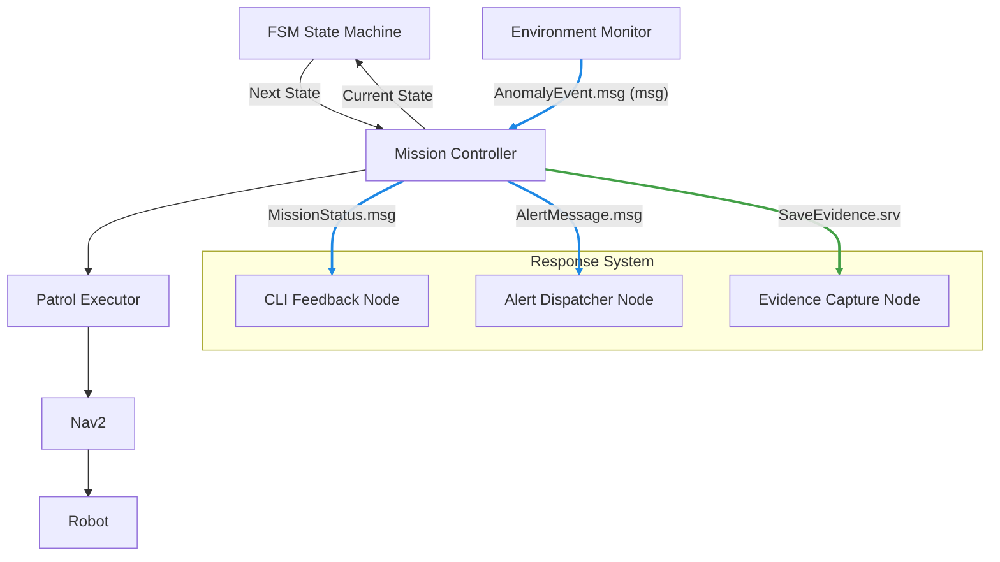

# 🤖 Autonomous Patrol System for TurtleBot4

[](https://docs.ros.org/en/humble/)
[](https://turtlebot.org/turtlebot4/)
[](LICENSE)
[](https://www.python.org/)

> **Autonomous patrol navigation powered by a Finite State Machine (FSM) architecture for TurtleBot4**

---

## 🎯 Overview

This repository implements an FSM-driven autonomous patrol system for TurtleBot4 using ROS 2.

The system is built around a Mission Controller node acting as the central orchestrator, which uses a Finite State Machine (FSM) to control robot behavior in a structured and scalable way.

Instead of distributing logic across nodes, this architecture ensures:

- centralized decision-making
- clean separation between logic and execution
- scalable and maintainable system design

The robot navigates between waypoints while dynamically reacting to events such as anomalies or obstacles.

---

## ✨ Key Features

| Feature                    | Description                                          |
| -------------------------- | ---------------------------------------------------- |
| 🔄 **FSM-Based Control**   | Behavior driven by a structured finite state machine |
| 🔁 **Cyclic Patrol**       | Navigate between waypoints in configurable loops     |
| 🎯 **Waypoint Navigation** | Precise goal posing with orientation control         |
| ⚙️ **Nav2 Integration**    | Built on `NavigateToPose` action client              |
| 🧩 **Modular Design**      | Clear separation between logic and execution         |
| 🧠 **Scalable Logic**      | Easily extend with new states and transitions        |
| 📝 **Structured Logging**  | Real-time feedback for debugging and monitoring      |

---

## 📦 Repository Structure

```text
Automated-Patrol-State-Machine/
├── README.md
├── LICENSE
├── package.xml
├── setup.py
├── setup.cfg
├── automated_patrol_state_machine/
│   ├── __init__.py
│   │
│   ├── nodes/                    # ROS interface layer
│   │   ├── patrol_executor_node.py
│   │   ├── environment_monitor_node.py
│   │   ├── evidence_capture_node.py
│   │   ├── alert_dispatcher_node.py
│   │   ├── cli_feedback_node.py
│   │   └── mission_controller_node.py
│   │
│   ├── fsm/                      # Decision-making layer
│   │   ├── state.py
│   │   ├── state_machine.py
│   │   └── states/
│   │       ├── patrol_state.py
│   │       ├── recovery_state.py
│   │       └── idle_state.py
│   │
│   └── utils/
│
├── config/
├── launch/
├── msg/
├── srv/
├── resource/
├── test/
└── docs/
```

---

## 🧠 System Architecture (FSM-Based)



---

## 🧭 FSM-Driven Patrol Executor

What it does

The patrol_executor_node is responsible for:

- executing robot movement
- interfacing with Nav2
- following FSM decisions

👉 It does NOT decide behavior — it only executes commands from the FSM.

## 🧠 FSM Layer

Components

| Component          | Role                              |
| ------------------ | --------------------------------- |
| `state.py`         | Base class for all states         |
| `state_machine.py` | Handles transitions and execution |
| `states/*.py`      | Individual robot behaviors        |

Example FSM Flow

```text
IDLE → PATROL → (Obstacle) → RECOVERY → PATROL
                ↓
          (Anomaly)
                ↓
        CAPTURE_EVIDENCE → ALERT → PATROL


```

⚙️ Design Principles

1. Separation of Concerns
   - Layer responsibility
   - Nodes: ROS communication
   - FSM: decision making
   - Config: runtime tuning
2. Thin Nodes
   - Do not contain logic
   - Only send and receive data
   - Call the FSM
   - Execute actions
3. Scalable Architecture
   - New behavior = new state
   - No need to rewrite nodes

## 🚀 Quick Start

### Prerequisites

- Ubuntu 22.04 LTS
- ROS 2 Humble Hawksbill
- TurtleBot4 packages installed
- Ignition Gazebo (for simulation)

### 1) Install Official Dependencies

```bash
# Update package list
sudo apt update

# Install TurtleBot4 and Nav2 packages
sudo apt install ros-humble-turtlebot4 \
                 ros-humble-turtlebot4-ignition-bringup \
                 ros-humble-turtlebot4-navigation \
                 ros-humble-nav2-bringup \
                 ros-humble-slam-toolbox \
                 ros-humble-tf-transformations \
                 python3-colcon-common-extensions
```

### 2) Clone This Repository

```bash
# Create workspace if needed
mkdir -p ~/turtlebot4_ws/src
cd ~/turtlebot4_ws/src

# Clone this repo
git clone https://github.com/mUchiha26/Automated-Patrol-State-Machine.git
```

### 3) Build the Package

```bash
cd ~/turtlebot4_ws
colcon build --packages-select automated_patrol_state_machine
source install/setup.bash
```

### 4) Run the Patrol Node

```bash
# Terminal 1: Ignition Simulation
ros2 launch turtlebot4_ignition_bringup turtlebot4_ignition.launch.py world:=maze

# Terminal 2: Navigation (with your map)
ros2 launch turtlebot4_navigation nav2.launch.py \
  map:=/opt/ros/humble/share/turtlebot4_navigation/maps/maze.yaml \
  use_sim_time:=true

# Terminal 3: Your patrol node
ros2 run automated_patrol_state_machine patrol_executor_node \
  --ros-args -p use_sim_time:=true
```

---

## 🧭 patrol_executor_node.py

### What it does

The `patrol_executor_node` implements

### High-level behaviour

```text
┌──────────────────────────────┐
│ patrol_executor_node         │
│                              │
│  ┌────────────────────────┐  │
│  │ FSM Interface          │  │
│  │ - Calls state machine  │  │
│  └────────┬───────────────┘  │
│           │                  │
│  ┌────────▼───────────────┐  │
│  │ Nav2 Action Client    │  │
│  │ - Send goals          │  │
│  │ - Handle results      │  │
│  └────────────────────────┘  │
└──────────────────────────────┘
```

⚠️ Key Architectural Insight

The FSM is the only component allowed to make decisions.
Nodes only execute.

### Parameters

| Parameter          | Type         | Default   | Description                                |
| ------------------ | ------------ | --------- | ------------------------------------------ |
| `use_sim_time`     | `bool`       | `true`    | Use simulation clock (required for Gazebo) |
| `total_cycles`     | `int`        | `3`       | Number of complete patrol loops to execute |
| `waypoints`        | `list[list]` | See below | List of `[x, y, yaw_degrees]` coordinates  |
| `waypoint_timeout` | `float`      | `30.0`    | Seconds to wait for navigation completion  |

### Example waypoint configuration (Python)

```python
self.waypoints = [
    # [x (m), y (m), yaw (degrees)]
    [-0.5, -0.5, 0.0],    # Start position
    [1.0, -0.5, 90.0],    # Turn right corridor
    [1.0, 1.0, 180.0],    # Top-right corner
    [-0.5, 1.0, 270.0],   # Top-left corner (return path)
]
```

### 🖧 Communication Design

#### Topics

| From               | To                 | Message             |
| ------------------ | ------------------ | ------------------- |
| Monitor            | Mission Controller | `AnomalyEvent.msg`  |
| Mission Controller | CLI                | `MissionStatus.msg` |
| Mission Controller | Alert              | `AlertMessage.msg`  |

#### Services

| From               | To            | Service            |
| ------------------ | ------------- | ------------------ |
| Mission Controller | Evidence Node | `SaveEvidence.srv` |

#### Actions

| From            | To   | Action           |
| --------------- | ---- | ---------------- |
| Patrol Executor | Nav2 | `NavigateToPose` |

### 🔄Execution Loop

1. System initializes with configuration files.
2. Mission Controller starts FSM.
3. FSM enters PATROL state.
4. Patrol Executor moves robot via Nav2.
5. Environment Monitor reads sensor data.
6. If anomaly is detected, an event is sent.
7. Mission Controller updates the FSM.
8. FSM triggers:

- evidence capture
- alert dispatch
- status update

9. Robot may enter recovery state.
10. System returns to patrol.
11. Loop continues.

## 🤝 Contributing

Contributions are welcome!

1. Fork the repository
2. Create a feature branch: `git checkout -b feature/anomaly-detector`
3. Commit your changes: `git commit -m 'Add anomaly detection logic'`
4. Push to the branch: `git push origin feature/anomaly-detector`
5. Open a Pull Request

### Coding standards

- Follow [PEP 8](https://pep8.org/) for Python code
- Use [ROS 2 logging](https://docs.ros.org/en/humble/Tutorials/Intermediate/Logging.html) instead of `print()`
- Document public functions with docstrings
- Add tests for new functionality

---

## 📄 License

This project is licensed under the **Apache License 2.0** — see the [LICENSE](LICENSE) file for details.

```text
Copyright 2024 Yasseene

Licensed under the Apache License, Version 2.0 (the "License");
you may not use this file except in compliance with the License.
You may obtain a copy of the License at

    http://www.apache.org/licenses/LICENSE-2.0

Unless required by applicable law or agreed to in writing, software
distributed under the License is distributed on an "AS IS" BASIS,
WITHOUT WARRANTIES OR CONDITIONS OF ANY KIND, either express or implied.
See the License for the specific language governing permissions and
limitations under the License.
```

---

## 🙏 Acknowledgments

- [TurtleBot4 Official Documentation](https://docs.turtlebot.org/turtlebot4/)
- [Nav2 Documentation](https://navigation.ros.org/)
- [ROS 2 Humble Documentation](https://docs.ros.org/en/humble/)
- Open Robotics community for amazing tools

---

## 📬 Contact

**Maintainer**: Yasseene  
**GitHub**: [@mUchiha26](https://github.com/mUchiha26)  
**Issues**: Report a bug or request a feature via the repository Issues page.

---
